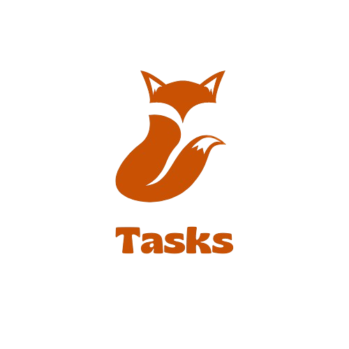
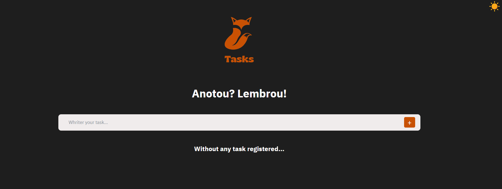
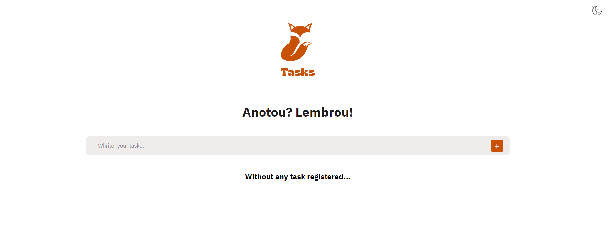

 ### 
 ## Sua lista de tarefas muito mais organizada ! Anotou? Lembrou! 
 ###  
 ## Tema escuro
 ### 
 ## Tema claro
 ### 
 ## Botões para trocar do tema escuro para o claro
### 
   

 ## Tarefa adicionada
 ### 
 ###  
 ### Quando selecionado o tema de preferencia do usuário, o mesmo é salvo a partir do localstorage. 
 
